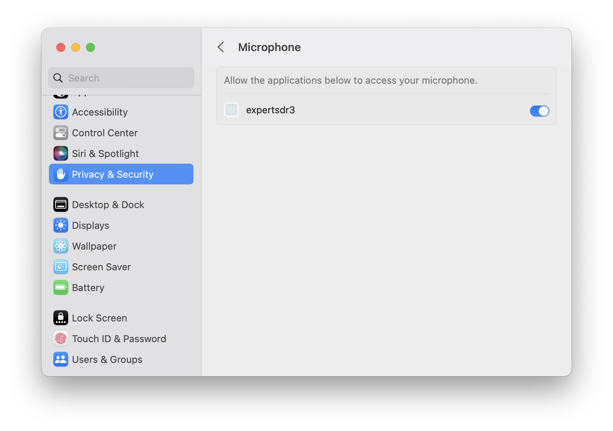

# Mic problem on macOS solved

On macOS, applications that want to use the microphone need to be granted access. This has been the case for quite a while. Applications that were not granted acces yet, show a dialog to request the user's permission. In my case that dialog never showed. So I created a [bug report](https://github.com/ExpertSDR3/ExpertSDR3-BUG-TRACKER/issues/531). After a while I received a message that referred to the README.txt that was included in the latest expertSDR3 version (1.0.2 beta).

Long story short, after copying `expertSDR3` to `Applications`, opening the `terminal` application and executing the following command solved the problem:

```bash
codesign --force --deep --sign - /Applications/ExpertSDR3.app
```

To verify access was granted open `System Preferences` and click `Privacy & Security`. Next select `Microphone`. If granting access for expertSDR3 succeeded you should see the following:


