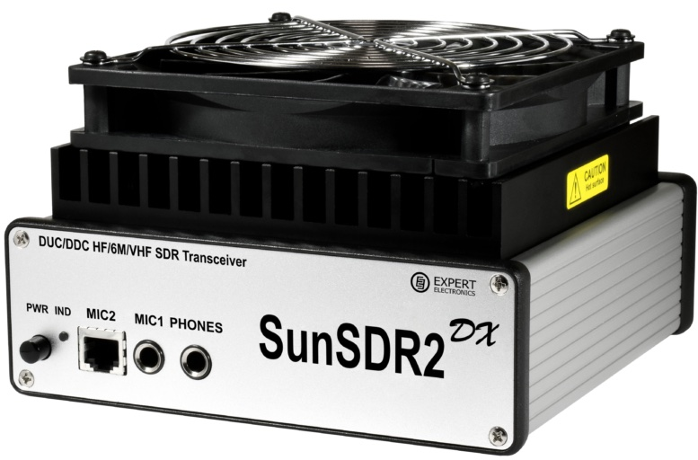

In December 2022, on Black Friday, I purchased a SunSDR2 DX at <a href="https://www.anico-hamshop.eu" target="_blank">Anico</a>.
A couple of days later my SunSDR2 DX arrived. Unfortunately, I had to wait to unpack because I was busy at work. During the Christmas holidays, I finally found the time to unbox it, integrate it into my home network, and get it on the air. To be honest, that took me more time than I expected.

In hindsight, I see a couple of reasons it took me fairly long to get it all up and running. Some aspects, like getting the mic input on my mac to work,
were only solved after days. Besides my own impatience, there are other apects that caused it all to take longer than necessary.

:::info
This website is powered by [Docusaurus](https://docusaurus.io/docs). I warmly welcome anyone who wants to contribute. You are encouraged to fork my [repo](https://github.com/jwluiten/jwluiten.github.io) and [contribute](https://docs.github.com/en/get-started/quickstart/contributing-to-projects) to this website.
:::

A network capable Software Defined transceiver operated from a laptop, is a very different beast than a traditional Yaesu or Kenwoord transceiver. Traditional transceivers only need to be connected to the power supply and the antenna to be ready to operate.

SDR based transceivers like the SunSDR introduce a number of complications (challenges?) that need to be mastered. In order to work properly they need to be integrated in your home network. They are operated through a piece of software (Frontend) that must be installed on your laptop. In case of the SunSDR the latest version, while easy to operate, has no manual yet. Information on the SunSDR is scattered over several places. While solutions for problems you might encounter are readily available, they are sometimes hard to find.

The challenges I encountered in getting my SunSDR on the air, are the reason for this website. My goal is to have a central location where I and others can write documentation and blog about our experiences with SunSDR, the expertSDR frontend and Ham Radio in general.
