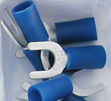

# Unboxing and connecting

This section will guide you through unboxing and connecting your SunSDR. What struck me about SunSDR's packaging is its solidity. There is zero chance of the transceiver being damaged during shipping.

## Connecting the powersupply

To ensure a firm connection with the power supply, I purchased a box of cable lugs.

        

Use a standard 13.8 V, 30 Amp powersupply.

## Connecting the antenna's

The SunSDR2 DX comes with one mini-uhf to PL cable. These cables are hard to come by. I ordered a couple of extra [cables](https://www.rys.nl/index.php?route=product/search&search=mini%20uhf) from Dutch vendor [Rys Electronics](https://www.rys.nl/index.php?route=common/home)
