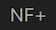

# Using notch filters

Notch filters suppress interfering signals.
These might be signals from neighboring stations or some other unknown source.
Notch filters allow you to eliminate this interference.
Using notch filters, you might work that rare DX you would miss without them.

There is the , the Automatic Notch Filter (ANF).
In my experience the ANF does an excellent job identifying and eliminating interfering signals.
In most cases it will succesfully suppres most interfering signals.
In rare cases where ANF is not able to succesfully suppress the interfering signals, the filter is your last resort.
You can add up to eight manually adjustable filters.

## Video

Expert Electronics posted a video on their youtube channel explaining how to use notch filters in ExpertSDR2.

<iframe width="747" height="420" src="https://www.youtube.com/embed/q4jM3S7dI0k?rel=0" frameborder="0" allow="accelerometer; autoplay; encrypted-media; gyroscope; picture-in-picture" allowfullscreen=""></iframe>

## Notch filters using ExpertSDR3

With respect to NFs there are a few subtle differences between ExpertSDR2 and ExpertSDR3. Using ExpertSDR3 on my MacBook, I observed the following:

- `left double-click` deletes a notch filter
- finger `slide-up` or `slide-down` on a Magic Mouse shifts the filter down or up in frequency
- ExpertSDR3 does not show the parameters of the NF
