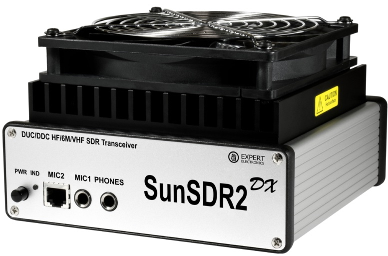

# Welcome

My name is Jan Willem Luiten, callsign PA3GNW. In December 2022, on Black Friday, I purchased a SunSDR2 DX at <a href="https://www.anico-hamshop.eu" target="_blank">Anico</a>.
A couple of days later my SunSDR2 DX arrived. Unfortunately, I had to wait to unpack because I was busy at work. During the Christmas holidays, I finally found the time to unbox it, integrate it into my home network, and get it on the air. To be honest, that took me longer than I expected.

:::info
This website is powered by [Docusaurus](https://docusaurus.io/docs). I warmly welcome anyone who wants to contribute. You are encouraged to fork my [repo](https://github.com/jwluiten/jwluiten.github.io) and [contribute](https://docs.github.com/en/get-started/quickstart/contributing-to-projects) to this website.
:::

## Why is this difficult?

In hindsight, I see a couple of reasons it took me fairly long to get it all up and running. Some aspects, like getting the mic input on my mac to work,
were only solved after days. Besides my own impatience, there are other aspects that caused it all to take longer than necessary.

A network capable Software Defined Radio operated from a laptop, is a very different beast than a traditional Yaesu or Kenwoord transceiver. Traditional transceivers only need to be connected to a power supply and an antenna to be ready to operate. SDR based transceivers like the SunSDR introduce a number of complications and challenges that need to be mastered.

### Networking

In order to work properly the SunSDR transceiver needs to be integrated in your home network. While most HAM operators are fairly proficient, this can present its challenges. The documentation on this site will guide you through this.

### Operating System

The SunSDR transceivers are &mdash;like most Software Defined Radios&mdash; operated through a piece of software (Frontend) that must be installed on your laptop. This not only brings all the capabilities but also all the complexities of the Operating System into play.

### No central source of information

Also, information on the SunSDR is scattered over several places. While solutions for problems you might encounter are readily available, they are sometimes hard to find. To make matter worse, the latest version (ExpertSDR3 1.0.2 beta), while easy to operate, has no manual at the time of this writing.

## Why is this easy?

Once you've got your SunSDR and ExpertSDR up and running, you're bound to find out that a growing number of relevant progams seamlessly integrate with expertSDR. Spots from the DX-cluster show up in the frequency spectrum of expertSDR. Skimmers tap into data provided by expertSDR and decode CW and a myriad of other digital modes.

### Look ma, no cables

CAT interfaces (Computer Aided Tuning) and CI-V adapters are no match for what expertSDR has to offer. Physical cables, the CI-V Interface and the CAT protocol all became obsolete.

### Transceiver Control Interface

Expert Electronics is setting a benchmark with their TCI protocol. Many suppliers already adapted their software to the TCI protocol. [SDC (Software Defined Connectors)](https://www.lw-sdc.com), [MacLoggerDX](https://www.dogparksoftware.com/MacLoggerDX.html) and many others run flawlessly with ExpertSDR3. Chasing DX, running digital modes and finding a running spot all of a sudden became a breeze.

## Let's help each other

The challenges I encountered in getting my SunSDR on the air, are the reason for this website. My goal is to help other Hams by creating a central location where I and others can write documentation and blog about our experiences with SunSDR, the expertSDR frontend and Ham Radio in general.

## Call to participate

I welcome everyone who wants to participate in growing our community.
